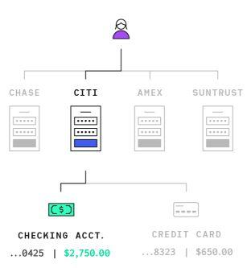

# Plaid Django

Plaid​ is an account aggregation service where users can login with their bank credentials and plaid fetches last two years of transaction and account balance data for their bank account. This project is its implementation using Django.

* `Item`​ , a set of credentials (map of key value pairs) associated with a financial institution and a user.
  * Users can have multiple Items for multiple financial institutions.

* Each `​Item​` can have many associated accounts, which hold information such as balance, name, and account type

    

* **Credit and depository**​ accounts can have `Transactions` associated with them

# Setting Up

Clone the project on your system::

    $ git clone https://github.com/iamabhishek0/plaid_django.git
    $ cd plaid_django

## Setting Database

You need to set up the database for the project. We are using CloudSQL here but you are free to use any DataBase of your choice. You will need to change the `settings.py` accordingly.

Before you can connect a mysql to a Cloud SQL instance, you must have:

* Created a Cloud SQL instance, including configuring the default user.

  * For more information about creating instances, see [Creating Instances](https://cloud.google.com/sql/docs/mysql/create-instance).

  * For more information about configuring the default user, see [Configuring the default user account](https://cloud.google.com/sql/docs/mysql/create-manage-users#user-root).

* Determined how you will connect to your instance.

  * For information about the available connection options and how to choose between them, see [Connection Options for External Applications](https://cloud.google.com/sql/docs/mysql/external-connection-methods).
    
* Installed the [mysql client](https://dev.mysql.com/downloads/mysql/).

* [Enable](https://console.cloud.google.com/flows/enableapi?apiid=sqladmin) the Cloud SQL Admin API.

Finally install the proxy and run::

    $ wget https://dl.google.com/cloudsql/cloud_sql_proxy.linux.amd64 -O cloud_sql_proxy
    $ chmod +x cloud_sql_proxy
    $ ./cloud_sql_proxy -instances=<INSTANCE_CONNECTION_NAME>=tcp:3306

In case there is some issue, you can find a detailed set up guide [here](https://cloud.google.com/sql/docs/mysql/connect-admin-proxy).

## Setting Up Redis

We are using Redis as our message broker for celery. Download [redis](https://redis.io/download) and extract the tar.gz file.

Open the folder and then in terminal run::

    $ make
    $ sudo make install

After that run the redis server::

    $ redis-server

## Setting Up Celery

Use pip to install necessary dependency::

    $ pip install -r requirements.txt

Migrate the changes for celery results::

    $ python manage.py migrate django_celery_results

Now start the worker process

    $ celery -A plaid_django worker -l info

Now celery worker is running in background. You can call the tasks asynchronously. You can test this by running test_celery() in django shell::

    $ python manage.py shell

    >>> from plaid_link.tests import test_celery
    >>> test_celery()

## Run Server
After setting up all the things you need to migrate the changes, create admin user and run the server::

    $ python manage.py makemigrations
    $ python manage.py migrate
    $ python manage.py createsuperuser
    $ python manage.py collectstatic
    $ python manage.py runserver

These were the steps for setting up first time. In case you already had set up the project you can start the server in few steps::

    $ ./cloud_sql_proxy -instances=<INSTANCE_CONNECTION_NAME>=tcp:3306
    $ redis-server
    $ celery -A plaid_django worker -l info
    $ python manage.py runserver
